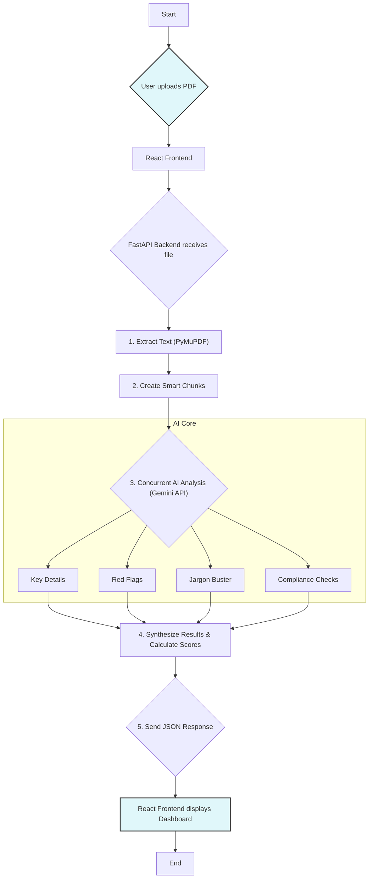

# Saarthi

**Jargon se Azadi**

[](https://opensource.org/licenses/MIT) [](https://www.python.org/) [](CONTRIBUTING.md)

Saarthi is an AI-powered financial document navigator designed to empower every Indian to understand the complex jargon and hidden clauses in loan agreements, insurance policies, and other financial documents. We bridge the information gap, translating dense legal text into simple, actionable insights.

Our mission is to bring transparency and confidence to your most important financial decisions.


---

## Key Features

* **Intelligent Data Extraction:** Automatically pulls key details like interest rates, fees, tenure, and EMI amounts from any PDF.
* **Red Flag Detection:** Proactively scans for and highlights predatory, unfair, or high-risk clauses that could harm you.
* **Jargon Buster:** Translates complex financial terms (like *Amortization* or *Subrogation*) into simple English and Hindi with real-world examples.
* **RBI Compliance Check:** Verifies if the document adheres to key guidelines from the RBI's Fair Practice Code, ensuring your rights are protected.
* **Comparative Analysis:** Benchmarks the terms in your document against current market averages to show if you're getting a fair deal.
* **Risk & Trust Scoring:** Generates an overall **Risk Score** for the document and a **Trust Score** for the lender, giving you a clear, at-a-glance verdict.
* **Actionable Recommendations:** Provides a prioritized list of next steps, from questions to ask the lender to specific points to negotiate.

---

## Workflow

This flowchart illustrates the end-to-end process from document upload to final analysis.


-----

## Tech Stack

Our platform is built with a modern, scalable tech stack:

  * **Backend:** Python, FastAPI, PyMuPDF, Google Gemini 2.0
  * **Frontend:** React, TypeScript, javascript, HTML, CSS
  * **Deployment:** Docker, Uvicorn

-----

## Getting Started

Follow these steps to get a local copy of Saarthi up and running.

### Prerequisites

  * Python 3.10+
  * Node.js v18+
  * A Google Gemini API Key

### Installation

1.  **Clone the repository:**

    ```bash
    git clone https://github.com/pushkar-hue/Sarthi.git
    cd Saarthi-v2
    ```

2.  **Setup the Backend (FastAPI):**

    ```bash
    # Navigate to the backend directory

    # Create and activate a virtual environment
    python -m venv venv
    source venv/bin/activate # On Windows: venv\Scripts\activate

    # Install dependencies
    pip install -r requirements.txt

    # Create a .env file and add your API key
    echo "GEMINI_API_KEY='YOUR_API_KEY_HERE'" > .env

    # Run the backend server
    uvicorn main:app --reload
    ```

    The backend will be running at `http://127.0.0.1:8000`.

3.  **Setup the Frontend (React):**

    ```bash
    # Open a new terminal and navigate to the frontend directory
    cd frontend

    # Install dependencies
    npm install

    # Run the development server
    npm run dev
    ```

    The frontend will be running at `http://127.0.0.1:5173`.

-----

## Usage

1.  Open your web browser and navigate to the frontend URL.
2.  Drag and drop or select a financial PDF document (e.g., a personal loan agreement).
3.  The analysis will begin automatically.
4.  Within moments, the dashboard will populate with a full, interactive breakdown of your document.

-----

## Future Enhancements

We have a bold vision for Saarthi. Here's our roadmap:

  * **Blazing Fast Async API:** Refactor the entire analysis pipeline to be fully asynchronous, running all AI checks concurrently to reduce processing time by over 70%.
  * **Real-time Streaming:** Implement a streaming response so the frontend populates with results as they are generated, providing an instantaneous user experience.
  * **Multi-Language Support:** Expand analysis and UI support for major Indian languages like Hindi, Tamil, and Bengali to improve accessibility.
  * **Expanded Document Support:** Train specialized models to analyze a wider range of documents, including:
      * Insurance Policies (Health, Life, Motor)
      * Rental Agreements
      * Investment Prospectuses
  * **AI Negotiation Coach:** Create a feature where the AI generates specific email or chat scripts that users can use to negotiate better terms with lenders based on the detected red flags.
  * **User Accounts & History:** Allow users to create accounts to save and track their document analyses over time, comparing offers and monitoring changes.
  * **API for Developers:** Launch a public API to allow other fintech apps and services to integrate Saarthi's powerful document analysis capabilities.
